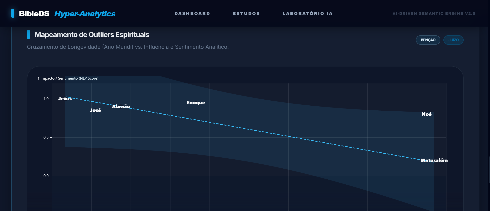

# 🚀 BibleDS Hyper-Analytics

<div align="center">
    <!-- Adicione a imagem do "Anexo I" aqui -->
    
</div>

<br>

## 📝 Descrição do Projeto

O **BibleDS Hyper-Analytics** tem como objetivo analisar o texto da Bíblia de forma semântica, utilizando inteligência artificial para mapear relacionamentos, traços cronológicos ("Ano Mundi") e extrair o sentimento e influência de personagens ao longo do tempo através de uma interface interativa (Hyper-Analytics Dashboard).

Desenvolvido com foco em **processamento de linguagem natural (PNL), análise de dados e imersão analítica de alta performance**, ele fornece uma nova perspectiva teológica e gráfica unindo dados estruturados de Big Data com a interatividade de web moderna (Observable Framework).

---

## 🛠️ Tecnologias e Ferramentas Utilizadas

Nesta seção, listamos as principais tecnologias que sustentam o projeto.

| Camada | Tecnologias |
|:---|:---|
| **Linguagem/Runtime** |   |
| **Frameworks/Libs** |    |
| **Banco de Dados/Dados** |  (Estruturado/Estático) |
| **DevOps/Cloud** |   |
| **Ferramentas** |   |

---

## ⚙️ Como Rodar o Projeto Localmente

Siga estes passos para configurar o ambiente e executar o projeto na sua máquina.

### 📋 Pré-requisitos

Antes de começar, você vai precisar ter instalado:
* [Node.js](https://nodejs.org/) versão 18 ou superior
* [Git](https://git-scm.com/)
* [Firebase CLI](https://firebase.google.com/docs/cli) *(Opcional, para deploy)*

### 🔧 Instalação e Execução

1.  **Clone o repositório:**
    ```bash
    git clone https://github.com/rilen/BibleDS.git
    cd BibleDS
    ```

2.  **Configure as variáveis de ambiente:**
    * Crie um arquivo `.env` (se houver integração local com a IA, por ex: `GEMINI_API_KEY`) e preencha com as suas configurações. **Nunca envie o `.env` real para o Git!**

3.  **Instale as dependências:**
    ```bash
    npm install
    # ou
    yarn install
    ```

4.  **Execute o projeto em desenvolvimento:**
    ```bash
    npm run dev
    # ou
    yarn dev
    ```

5.  **Acesse a aplicação:**
    A aplicação estará rodando em `http://localhost:3000`.

---

## 📁 Estrutura do Projeto (Visão Geral)

Para facilitar a navegação, aqui está uma breve descrição da organização das pastas no Observable Framework.

```text
BibleDS/
├── src/                  # Código-fonte e páginas Markdown da aplicação
│   ├── data/             # Processamento de dados e JSONs (Dataloaders)
│   ├── styles/           # Estilos globais e customizações custom CSS
│   └── *.md              # Páginas de conteúdo iterativas (dashboard, etc.)
├── dist/                 # Build de arquivos estáticos gerados em prod
├── .firebase/            # Cache e metadados de hospedagem
├── observablehq.config.js# Configurações do ambiente do Observable
├── firebase.json         # Configuração de deploy no Firebase Hosting
├── tailwind.config.js    # Arquivo de configuração do Tailwind CSS
└── README.md             # Este arquivo
```

---

# Rilen T. L. - DataScience

**25+ anos em TI - Especialista em Big Data | IA | CyberSecurity**

***Full Stack Development & Data Intelligence***

Rio das Ostras · RJ · Brasil · PcD (Implante Coclear)

[](https://www.linkedin.com/in/rilen/)
[](mailto:rilen.lima@gmail.com)
[](https://rilen.github.io/portfolio/)

---
